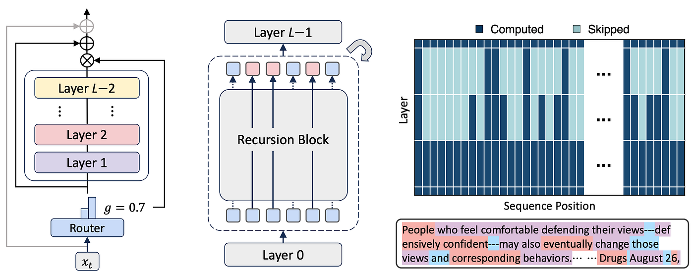
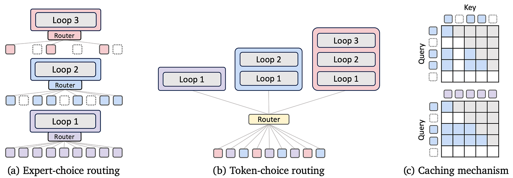

# MoR-LLM: Mixture-of-Recursions Transformer Implementation

<div align="center">



[](https://www.python.org/)
[](https://pytorch.org/)
[](https://arxiv.org/html/2507.10524v1)
[](https://opensource.org/licenses/MIT)

**A PyTorch implementation of "Mixture of Recursions: Parameter-Efficient Transfer via Recursive Sharing"**

</div>

## 📑 Table of Contents

- [Overview](#overview)
- [Mixture-of-Recursions Architecture](#mixture-of-recursions-architecture)
- [Key Features](#key-features)
- [Installation](#installation)
- [Usage](#usage)
- [Configuration](#configuration)
- [Datasets](#datasets)
- [Scaling to LLMs](#scaling-to-llms)
- [Future Work](#future-work)
- [Citation](#citation)
- [License](#license)

## Overview

This repository implements the **Mixture-of-Recursions (MoR)** architecture introduced by Google Research in the paper ["Mixture of Recursions: Parameter-Efficient Transfer via Recursive Sharing"](https://arxiv.org/html/2507.10524v1). MoR represents a significant advancement in efficient transformer architecture design, reducing computational requirements while maintaining or improving performance.

Unlike traditional transformers that use separate weights for each layer, MoR recursively shares parameters across layers while using dynamic routing mechanisms to preserve model expressivity. This approach allows for training larger models with fewer parameters, making LLM training more accessible to researchers with limited computational resources.

## Mixture-of-Recursions Architecture

The MoR architecture is built on three key innovations:



### 1. Recursive Parameter Sharing

MoR recursively shares parameters across transformer layers using a configurable sharing strategy. The default strategy is **Middle-Cycle**, which provides optimal parameter efficiency.

**Mathematical Formulation:**

For a model with $N_r$ recursive blocks and a maximum recursion depth $d_{max}$, the effective number of layers is:

$$N_{effective} = N_r \times d_{max}$$

While the parameter count scales with $N_r$, not with $N_{effective}$, resulting in parameter savings of approximately:

$$\text{Parameter Savings} \approx (1 - \frac{1}{d_{max}}) \times 100\%$$

### 2. Dynamic Routing Mechanisms

MoR implements two sophisticated routing mechanisms that determine how tokens progress through recursive computation paths:

#### 2.1 Expert-Choice Routing

In expert-choice routing, each recursion depth acts as an expert that selects its preferred top-k tokens. For $N_r$ recursion steps, we have $N_r$ experts, where Expert $r$ applies the $r^{th}$ recursion step.

At each recursion step $r$:
1. The router computes a scalar score for each token $t$:
   $$g_t^r = \mathcal{G}(\theta_r^\top \mathcal{H}_t^r)$$
   where $\mathcal{G}$ is an activation function (sigmoid/tanh) and $\mathcal{H}_t^r$ is the hidden state at step $r$.

2. The hidden state updates as:

   

   Where $P_\beta(G^r)$ is the $\beta$-percentile threshold over all scores at step $r$.

**Key Features:**
- Hierarchical filtering: Tokens must be selected at step $r$ to progress to $r+1$
- Simulates early-exit behavior
- Prioritizes computation for demanding tokens

#### 2.2 Token-Choice Routing

Token-choice commits each token to a full sequence of recursion blocks from the start:

1. The router computes expert scores using the initial hidden state:

   $$g_t = \mathcal{G}(\theta_r^\top \mathcal{H}_t^1)$$

   where $g_t^j$ is the score for expert $j \in \{1,...,N_r\}$

2. The token is assigned to expert $i = \arg\max_j g_t^j$, applying $i$ recursive updates:

   

**Key Features:**
- Commits to computation path upfront
- More stable training dynamics
- Simpler routing logic

#### 2.3 Routing Strategy Comparison

| Feature | Expert-Choice | Token-Choice |
|---------|--------------|--------------|
| Decision Point | Per recursion step | Initial token processing |
| Flexibility | High (dynamic per step) | Fixed after assignment |
| Training Stability | More challenging | More stable |
| Best For | Variable complexity inputs | Consistent computation paths |

#### 2.4 Routing Probability Formulation

Both strategies use a router network $R$ to compute token-to-expert assignment probabilities:

$$p(d|x_i) = \text{softmax}(R(x_i)_d)$$

Where:
- $R$ is the trainable router network
- $x_i$ is the token representation
- $d$ is the recursion depth/expert index

### 3. Efficient KV Caching

MoR's custom KV caching system optimizes memory usage during inference, supporting variable recursion depths per token:

$$\text{KV}_{\text{cache}}[i, j] = \begin{cases}
\text{KV}(x_i, \text{layer}_j) & \text{if } j \leq \text{depth}(x_i) \\
\emptyset & \text{otherwise}
\end{cases}$$

## Key Features

- **Recursive Transformer Layers**: Parameter-efficient architecture with configurable sharing strategies
- **Dynamic Routing System**: Token-Choice and Expert-Choice routing mechanisms
- **Efficient KV Caching**: Memory-optimized caching for variable recursion depths
- **Scalable Architecture**: Same code supports small research models to large LLMs
- **Distributed Training**: Fully Sharded Data Parallel (FSDP) for multi-GPU training
- **Mixed Precision Training**: FP16/BF16 support for memory efficiency
- **Gradient Checkpointing**: Memory optimization for large-scale training
- **Comprehensive Configurations**: Ready-made configs for small, medium, and large models

## Installation

```bash
# Clone the repository
git clone https://github.com/gowtham-source/MoR-LLM-Mixture-of-Recursions-Small-Large-Language-Model.git
cd MoR-LLM-Mixture-of-Recursions-Small-Large-Language-Model

# Create environment and install dependencies
uv venv
uv pip install -r requirements.txt 

or

uv init
uv add -r requirements.txt
```

## Usage

### Training

```bash
# Small model training (for development/testing)
uv run train.py --config configs/small_model.yaml

# Multi-GPU training for larger models
torchrun --nproc_per_node=4 train.py --config configs/medium_llm.yaml
```

### Inference

```bash
# Interactive generation
uv run inference.py --model_path path/to/checkpoint --interactive

# Interactive generation with adaptive recursion
uv run inference.py --model_path path/to/checkpoint --interactive --recursion_strategy adaptive

# Interactive generation with uniform recursion depth
uv run inference.py --model_path path/to/checkpoint --interactive --recursion_strategy uniform --recursion_depth 4

# Interactive generation with progressive routing
uv run inference.py --model_path path/to/checkpoint --interactive --routing_strategy progressive

# LLama Tokenizer
uv run inference.py --model_path path/to/checkpoint --tokenizer meta-llama/Llama-2-7b-hf


# Normal generation - sample
uv run inference.py --model_path checkpoints/<model_name>.pt --text "Once upon a time" --max_new_tokens 100 --temperature 0.7 --top_p 0.9 --top_k 50 


# For testing the code
uv run examples/quick_start.py
```

### Example Code

```python
from mor_model import MoRTransformerLM
from mor_inference import MoRInferenceEngine

# Load model from checkpoint
engine = MoRInferenceEngine("checkpoints/model.pt")

# Generate text
output = engine.generate(
    prompt="Explain quantum computing in simple terms",
    max_new_tokens=100,
    temperature=0.7,
    recursion_strategy="adaptive"
)

print(output)
```

## Configuration

MoR-LLM uses YAML configuration files for model architecture and training settings:

```yaml
model:
  hidden_size: 512
  num_recursion_blocks: 4
  parameter_sharing_strategy: "middle_cycle"
  max_recursion_depth: 4
  routing_strategy: "expert_choice"
```

Refer to `configs/` directory for example configurations:
- `small_model.yaml`: Research/development model (68M parameters)
- `medium_llm.yaml`: Medium-scale LLM (1.3B parameters)
- `large_llm.yaml`: Large-scale LLM (7B parameters)

## Datasets

MoR-LLM supports various datasets:

- HuggingFace datasets (e.g., TinyStories, WikiText)
- Custom datasets (.txt, .jsonl, .csv, .parquet)

See `docs/DATASET_GUIDE.md` for detailed instructions.

## Scaling to LLMs

MoR architecture is designed to scale from small language models to large-scale LLMs. The recursive parameter sharing makes LLM training more accessible with limited resources.

For detailed scaling guidance, see `docs/LLM_SCALING_GUIDE.md`.

## Current Status and Results

Due to limited computational resources, I haven't been able to train the model to completion with large-scale configurations. However, preliminary results with small-scale experiments demonstrate the working implementation of MoR's core concepts.

**Note:** This repository focuses on providing a faithful implementation of the MoR architecture. Results will vary based on training duration, data quality, and available compute. Full training results will be added in future updates as more resources become available.

## Future Work

Several enhancements are planned for future development:

- **RLHF Integration**: Reinforcement Learning from Human Feedback for alignment
- **Decoder-only Architecture Optimization**: Further refinements to the transformer architecture
- **SwiGLU Activation**: Implementation of SwiGLU activation function for performance enhancement
- **Quantization Support**: INT8/INT4 quantization for faster inference
- **Multimodal Extensions**: Extending MoR architecture to multimodal applications

## Citation

If you use this code in your research, please cite both this repository and the original paper:

```bibtex
@misc{bae2025mixturerecursions,
      title={Mixture-of-Recursions: Learning Dynamic Recursive Depths for Adaptive Token-Level Computation},
      author={Sangmin Bae and Yujin Kim and Reza Bayat and Sungnyun Kim and Jiyoun Ha and Tal Schuster and Adam Fisch and Hrayr Harutyunyan and Ziwei Ji and Aaron Courville and Se-Young Yun},
      year={2025},
      eprint={2507.10524v1},
      archivePrefix={arXiv},
      primaryClass={cs.LG},
      license={CC BY 4.0}
}

@software{mor_LLM_implementation,
  author = {Gowtham},
  title = {MoR-LLM: Mixture-of-Recursions Transformer Implementation},
  url = {https://github.com/gowtham-source/MOR-LLM},
  year = {2025},
}
```

## License

This project is licensed under the MIT License - see the [LICENSE](LICENSE) file for details.

---

<div align="center">
<p>Built with ❤️ by researchers for researchers</p>
</div>
